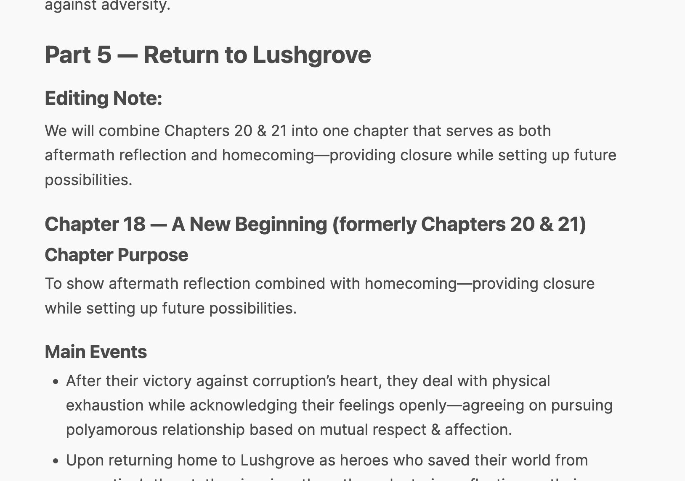

# CyberKitty

CyberKitty is an experimental human+ai hybrid novel editor that explores the question
"What does the human creation of literature look like in a world of ubiquitous AI?".

It was inspired by my secondary craft—writing niche queer literature—and my frustration that
there wasn't more of it available. It was also inspired by a hacker news post I read when I was
coming down with a fever, talking about how programming innovations have led to programmers
working in higher level abstractions, not programmers being replaced. This was built in
roughly the next week.

In a world where words are cheap but ideas are precious, can we make high quality content easier to
produce and discover? In the same way programmers no longer write in assembly, can we produce
higher level programming for writers? Can we elevate writers instead of replacing them?

If I haven't hit my monthy API limit, you can try a single user (not private!) demo
at [cyberkitty.ai](https://cyberkitty.ai).

Using it to generate a story and customize an outline:

https://github.com/JuliaMerz/cyberkitty/assets/5734804/8818af08-6bbe-450c-b5dc-cbbfcd5238b0

Using it to edit outlines and generate scenes:

https://github.com/JuliaMerz/cyberkitty/assets/5734804/c4d170c4-36bb-470c-bb0a-d5a9c26baecf

Editing and displaying text:

https://github.com/JuliaMerz/cyberkitty/assets/5734804/40496869-0b92-4507-aaaf-96f103b7abb1


## Usage
To run cyberkitty, you'll need to create a `.env` file.

```
OPENAI_API_KEY=sk-<your OpenAI key>
SECRET_KEY="<generate a secret key>"
DB_HOST=test.db
DB_PASS=
DB_USER=root
DB_NAME=cyberkitty
DB_DRIVER=sqlite
```
I generated my secret key with `openssl rand -base64 32`.

Then run
```
docker compose build
docker compose up
```

Assuming everything went right, you'll be able to access the UI at `cyberkitty.localhost`.

## Advanced

There will, at some point, be a multi-user production version (the user/permission system is already integrated
with the queries/stories, it just needs token tracking and a stripe integration) but I am
no longer sick and going outside again, so that will likely take a while. For now the prod
docker compose can be handy if you want to host your installation on a web server and
automatically register an https cert. (It will also disable traefik's control panel, which
is crucial for external hosting).

If you'd like to make the installation accessible to non-localhost, just change the instances
of `cyberkitty.localhost` in the `dockercompose.yml` to your domain name or IP—traefik will
stop filtering the traffic and allow users access.

## Techniques
CyberKitty does a couple of things under the hood to make all of this possible.

### Tree Generation
CyberKitty internally stores novels as a multi-level tree. In order to handle context limitations
and limit token cost, it limits its generation inputs to the node being generated, it's previous
sibling, and its parent nodes. By excluding aunts/uncles and cousins, we constrain costs and
kep GPT focused.

GPT also seems pretty tuned on responses of a certain length, so we choose the number layers
based on the eventual target output length. For a full length novel, experimental testing
suggested that around five layers is appropriate.

### Context Lists
This is pretty well understood, but by having it generate lists of themes and plotlins and other
important information and feeding them back during generation, we can keep GPT significantly
more focused than it woudl be otherwise.

### Iterative Generation + Self Editing
One weakness of LLM's "reasoning" capabilities is that they are only retroactive. They
can say "x and y happened earlier, so z happened now" They cannot say "z will happen in the future
so y needs to happen now". One way of getting around this is to iteratively generate, which effectively
moves the entire text into the past.

We can build on this by asking it to make edits and by asking it to set intentions and make notes
about its editing. Its desire to fulfill the request for "improvement notes" forces it to come up with ideas,
and those ideas being at the top of its generated output mean that when it's doing revisions it's constantly
trying to fulfill the edit requests.



### Prompt Engineering/Imitation
By default GPT produces work that is the rough average of its inputs, applicable to its current output.
We get about a 20% improvement in writing quality by modifying its system prompt to include "you are an author
that writes tight, high quality prose." There's similar small adjustments like this sprinkled throughout
the underlying prompt engineering, including specific nudges for creating dialogue or writing in a non-summarizing
perspective. Check out `prompt_generator.py` for a full rundown of the prompting algorithm.

### Human Interface
Surprisingly, the harder step from here is making the *human* part of this tractable. AI
can generate a novel draft in 10-20 minutes. The last time I planned a full novel it took me
200 sticky notes and three days. Then many more days iterating as I wrote the novel.

*Editing* a 35k word novella (that's half a full novel) that I'd personally written took 2-3 weeks.
This is *normal* in the writing industry, but it means that efficiency gains can only really come
if we make it easy for the human brain to internalize and work with the novel.

CyberKitty achieves this with a combination of collapsible rendering and a maximally intuitive editing interface. Just
click to edit, unclick to autosave, and you can think about the next component. It also warns you
when you've edited something that would normally be an input to AI generation, so you can decide
if you want to rerender. (it does not yet allow for undo or keep you from rerendering over your own work, be warned!)

## Expectations and Outcomes
The hardest part of working on this for me was not setting my own bar at "AI creates infinite books."
Can GPT generate a full work of fiction? yes. Try it in the editor. It requires 500k or so tokens, 20ish bucks,
 and like every other current (Nov '23) GPT application it will produce mid-range prose, acceptable concepts,
and occasional word soup.

Prompting techniques get us closer to the state of the art, but fundamentally these things will improve
as AI models improve as AI models improve. The biggest takeaway from running this through some
writer and non-writer friends is how much of a difference the UI makes. Despite ChatGPT already
existing there were some genuine "wow" moments for people seeing their story ideas taken from
small concept -> big concept -> outline. It's not robust enough yet as an editor for me to trust
a full story with it, and as a writer I'm pretty obsessive about _my_ language and prose shinging
through the final work, but this definitely gave me some inspiration for future experiments.

# Issues
If something breaks it's almost certainly related to the pipeline from LLM output -> structured data.
Giving clear formatting instructions has, so far, worked about 70% of the time. The rest we've
covered for with progressively loser and more flexible regex. A longer term solution might involve
some kind of fuzzy matching or middle-dumb text comprehension like an NLP parser to bridge the gap,
but that takes longer than a single flu to build.

# Development
Typing for the frontend is generated with pydantic2ts, using the command:
```
pydantic2ts --module server/main.py --output frontend/src/apiTypes.ts --json2ts-cmd "yarn json2ts" --exclude ApiCallBase --exclude QueryBase --exclude StoryBase --exclude StoryOutlineBase --exclude ChapterOutlineBase --exclude SceneOutlineBase --exclude SceneBase --exclude BaseSettings --exclude Settings --exclude BaseSQLModel --exclude SQLModel
```

To run the dev server:
```
pipenv install
uvicorn server.main:app --reload --reload-dir server
```
The `--reload-dir` is important here, since otherwise you'll monitor the entire `frontend` directory. I've also
exported the pipenv to a `requirements.txt` for docker, so `pip` should work as a substitute for `pipenv`.

You'll also need to change some of the env variables.

For the frontend just use the classic `yarn install; yarn start`

If you make changes to the models you'll want to
```
alembic revision --autogenerate -m "<message>"
alembic upgrade head
```
